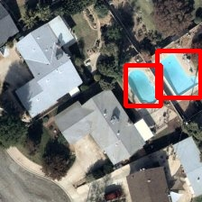
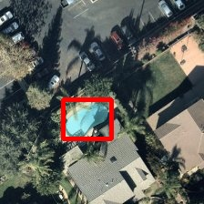
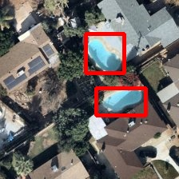
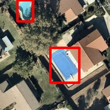
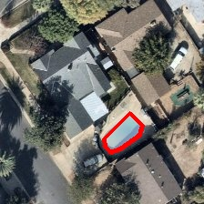

# Swimming Pool Detection

Automatic detection of swimming pools in aerial/satellite imagery using YOLOv11 deep learning model.

## Project Description

This project detects swimming pools of any shape (rectangular, oval, irregular) in aerial images and outputs:
- **coordinates.txt**: Boundary coordinates of detected pools
- **output_image.jpg**: Input image with red outlines around detected pools

The system uses a YOLOv11 model trained on 1,224 aerial images, achieving **97% mAP50** accuracy.

---

## Quick Start

### 1. Setup

```bash
# Clone and enter project
cd swimming-pool-detection

# Run setup script (creates venv and installs dependencies)
./setup

# Activate virtual environment
source venv/bin/activate
```

### 2. Detect Swimming Pools

**Option A: Use the detection script**
```bash
# Put your images in test_images folder
cp your_aerial_image.jpg test_images/

# Run detection
./detect.sh
```

**Option B: Run directly with Python**
```bash
# Single image
python inference/detect_pools.py --input path/to/image.jpg

# Directory of images
python inference/detect_pools.py --input path/to/images/ --output-dir results
```

### 3. View Results

Results are saved to the `output/` folder:
```
output/
  image_name/
    coordinates.txt      # Pool boundary coordinates
    output_image.jpg     # Image with red pool outlines
```

---

## Sample Results

Here are examples of the model detecting swimming pools in aerial imagery:

| Input Image | Detection Result |
|-------------|------------------|
|  |  |
|  |  |
|  |  |
|  |  |
|  |  |

The model (YOLOv11s) achieves **97.7% mAP50** and **93.6% precision** on the validation set. 

### Coordinates File Format

Each detected pool generates a `coordinates.txt` file:

```
Pool Detection Coordinates
Confidence: 0.8106
Boundary Points:
139,75
175,75
175,117
139,117
```

The coordinates represent the bounding box corners (x,y) in pixels.

---

## Detection Options

| Option | Default | Description |
|--------|---------|-------------|
| `--input` | required | Input image or directory |
| `--model` | `weights/best.pt` | Path to model weights |
| `--output-dir` | `output` | Output directory |
| `--conf-threshold` | `0.5` | Detection confidence threshold |
| `--img-size` | `640` | Inference image size |

**Example with custom options:**
```bash
python inference/detect_pools.py \
    --input aerial_photo.jpg \
    --conf-threshold 0.5 \
    --output-dir my_results
```

---

## Model Information

| Attribute | Value |
|-----------|-------|
| Architecture | YOLOv11s |
| Input Size | 512x512 |
| Training Images | 856 |
| Validation Images | 244 |
| Test Images | 124 |
| **mAP50** | **0.977** |
| **mAP50-95** | **0.599** |
| Precision | 0.936 |
| Recall | 0.942 |
| Inference Speed | ~25ms/image (GPU) |

---

## Training (Optional)

To train your own model:

### 1. Prepare Dataset
```bash
# Download dataset from Kaggle
python datasets/download_dataset.py --source kaggle

# Convert annotations to YOLO format
python preprocessing/annotation_converter.py \
    --format voc \
    --input data/raw/kaggle/labels \
    --output data/processed/labels \
    --class-names pool

# Create train/val/test splits
python preprocessing/create_splits.py
```

### 2. Train Model
```bash
python training/train.py --config config/training_config.yaml
```

### 3. Training Configuration

Edit `config/training_config.yaml` to customize:
- Model variant (yolov11n/s/m/l/x)
- Epochs, batch size, image size
- Learning rate, optimizer
- Early stopping patience

---

## Project Structure

```
swimming-pool-detection/
├── detect.sh              # Quick detection script
├── weights/best.pt        # Trained model
├── inference/             # Detection scripts
├── training/              # Training scripts
├── preprocessing/         # Data preparation
├── config/                # Configuration files
├── data/                  # Dataset storage
├── test_images/           # Put images here for detection
└── output/                # Detection results
```

---

## Requirements

- Python 3.9+
- CUDA GPU (recommended) or CPU
- ~4GB GPU memory for inference

---

## License

MIT License
